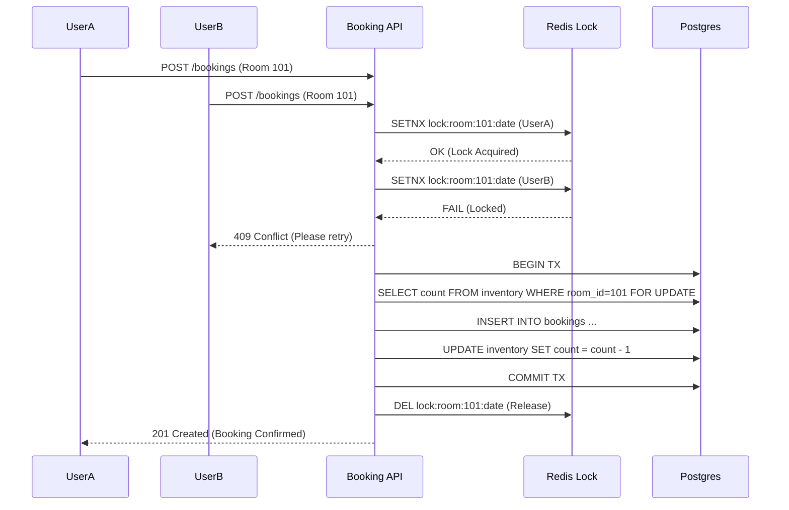
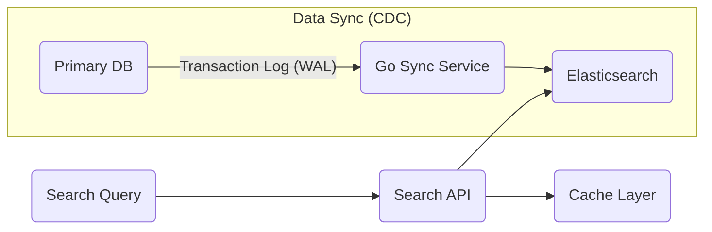
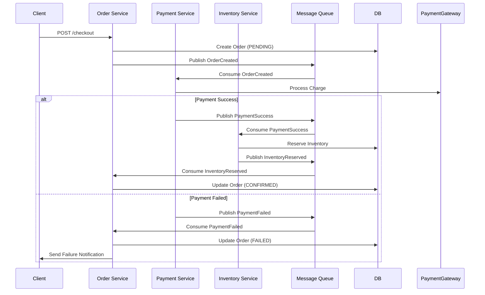

# MASTER FLOW: The Hotel Booking Trinity

This document outlines the **End-to-End Execution Flow** for the project, broken down by the key system design challenges.

---

## 🟢 FLOW 1: The Transactional Core (Concurrency)
**Problem**: Two users book the same room at the same time.
**Solution**: Pessimistic/Optimistic Locking or Redlock.

### 1.1 Diagram

### 1.2 Implementation Steps
1.  **Backend**: Go routine to acquire lock with retry mechanism (Exponential Backoff).
2.  **Database**: Transaction with Isolation Level (Serializable or Repeatable Read).
3.  **Frontend**: Optimistic UI update -> Rollback on 409 error.

---

## 🟡 FLOW 2: The Search Engine (Performance)
**Problem**: Searching 1M hotels by location is slow in SQL. Text search is limited.
**Solution**: Elasticsearch + PostGIS for geo-fencing + CDC Sync.

### 2.1 Diagram

### 2.2 Implementation Steps
1.  **Ingestion**: Seed 10k dummy hotels with random Lat/Long in Postgres.
2.  **Sync**: Go worker reads from Postgres (listen/notify or polling) -> Bulk Index to Elasticsearch.
3.  **Client**: Mapbox GL JS (Web) / React Native Maps (Mobile) to send viewport bounds (NE, SW).
4.  **Query**: Elasticsearch Geo-Distance query + Filter by Price/Amenities.

---

## 🔵 FLOW 3: The Payment Saga (Distributed Workflow)
**Problem**: Payment succeeds but booking fails (or vice versa). System needs consistency across services.
**Solution**: Choreography Saga Pattern (Event-Driven).

### 3.1 Diagram

### 3.2 Implementation Steps
1.  **Message Broker**: RabbitMQ setup (Exchanges: `booking.events`, `payment.events`).
2.  **Idempotency**: Ensure message processing is idempotent (store processed Message IDs in Redis).
3.  **State Machine**: Order Service tracks state: `CREATED` -> `PAID` -> `CONFIRMED` or `FAILED`.
4.  **Compensation**: If inventory reservation fails after payment, trigger Refund transaction.

---

## 📱 CLIENT-SIDE FLOWS (Web & Mobile)

### 4.1 Global State (Zustand/Context)
- **User**: Auth Token, Profile.
- **Search**: Location, Dates, Guests (Persisted in URL on Web, AsyncStorage on Mobile).
- **Booking**: Current draft booking ID.

### 4.2 Shared Logic (Hooks)
- `useSearchHotels()`: Debounced search, handles loading/error states.
- `useBookingFlow()`: Manages the Saga steps (polling for final status).
- `useRealtimeNotifications()`: WebSocket connection for async updates.
