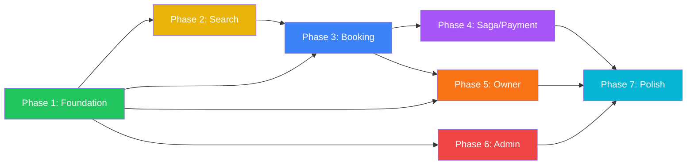

# PLAN: React Native Mobile Booking App (StayEase)

> **Plan ID**: `PLAN-mobile-booking-app`
> **Created**: 2026-02-14
> **Stack**: React Native (Expo) + Expo Router + NativeWind + Zustand + React Query
> **Roles**: Guest/User, Hotel Owner, Admin
> **Backend Refs**: `task_plan_concurrency.md`, `task_plan_search.md`, `task_plan_saga.md`

---

## 📋 Table of Contents

1. [Executive Summary](#-1-executive-summary)
2. [Architecture Overview](#-2-architecture-overview)
3. [Tech Stack & Dependencies](#-3-tech-stack--dependencies)
4. [Directory Structure](#-4-directory-structure)
5. [Role-Based Feature Matrix](#-5-role-based-feature-matrix)
6. [Phase Breakdown](#-6-phase-breakdown)
7. [Screen Inventory & Navigation Map](#-7-screen-inventory--navigation-map)
8. [API Integration Map](#-8-api-integration-map)
9. [Design System](#-9-design-system)
10. [Verification Plan](#-10-verification-plan)
11. [Risk Assessment](#-11-risk-assessment)

---

## 🎯 1. Executive Summary

Build a **premium, production-grade** mobile booking application (akin to Booking.com / Agoda / Traveloka) using **React Native with Expo**. The app will serve **3 distinct user roles** with tailored experiences, and will integrate directly with the existing **Golang backend** that implements:

- **Concurrency Control** — Distributed Redis locking for race-condition-free bookings
- **Geo-spatial Search** — Elasticsearch + PostGIS powered hotel discovery
- **Event-Driven Saga** — Asynchronous payment & notification via RabbitMQ

### Success Criteria
- [ ] All 3 roles can perform their core workflows end-to-end
- [ ] Booking flow handles 409 Conflict (concurrency) gracefully
- [ ] Map-based search with geo-filtering works on both iOS & Android
- [ ] Payment saga status polling/WebSocket shows real-time booking state
- [ ] App achieves **60 FPS** on mid-range devices
- [ ] Lighthouse/React Native Performance score: **>90**

---

## 🏗️ 2. Architecture Overview

### 2.1 High-Level Architecture

```
┌─────────────────────────────────────────────────────────┐
│                    MOBILE APP (Expo)                     │
│                                                         │
│  ┌─────────────┐  ┌──────────────┐  ┌────────────────┐  │
│  │  Guest/User │  │  Hotel Owner │  │     Admin      │  │
│  │    Tabs     │  │    Tabs      │  │     Tabs       │  │
│  └──────┬──────┘  └──────┬───────┘  └───────┬────────┘  │
│         │                │                   │           │
│  ┌──────▼────────────────▼───────────────────▼────────┐  │
│  │              Shared Services Layer                 │  │
│  │  ┌─────────┐ ┌──────────┐ ┌───────────────────┐   │  │
│  │  │ Zustand │ │  React   │ │   WebSocket/SSE   │   │  │
│  │  │  Store  │ │  Query   │ │   (Real-time)     │   │  │
│  │  └─────────┘ └──────────┘ └───────────────────┘   │  │
│  └────────────────────┬──────────────────────────────┘  │
│                       │ HTTPS / WSS                      │
└───────────────────────┼──────────────────────────────────┘
                        │
┌───────────────────────▼──────────────────────────────────┐
│                  BACKEND (Go + Gin)                       │
│                                                          │
│  ┌──────────┐  ┌──────────┐  ┌────────────────────────┐  │
│  │ Booking  │  │  Search  │  │  Payment/Notification  │  │
│  │ Service  │  │  Service │  │       Service          │  │
│  │ (Redis   │  │ (Elastic │  │    (RabbitMQ +         │  │
│  │  Lock)   │  │  Search) │  │     Outbox)            │  │
│  └──────────┘  └──────────┘  └────────────────────────┘  │
│                                                          │
│  ┌──────────┐  ┌──────────┐  ┌────────────────────────┐  │
│  │PostgreSQL│  │  Redis   │  │    Elasticsearch       │  │
│  └──────────┘  └──────────┘  └────────────────────────┘  │
└──────────────────────────────────────────────────────────┘
```

### 2.2 Data Flow Alignment with Backend Tasks

| Mobile Feature | Backend Task Plan | API Endpoints | Key Behavior |
|---|---|---|---|
| **Book a Room** | `task_plan_concurrency.md` | `POST /bookings` | Handle `201 Created` + `409 Conflict` with retry UX |
| **Search Hotels** | `task_plan_search.md` | `GET /hotels/search` | Geo-spatial filter, map bounds, debounced input |
| **Payment Flow** | `task_plan_saga.md` | `POST /checkout`, `GET /bookings/{id}/status` | Poll/WebSocket for saga state transitions |
| **Real-time Updates** | `task_plan_saga.md` | WebSocket `/ws/bookings` | Live status: PENDING → PAID → CONFIRMED |

---

## ⚙️ 3. Tech Stack & Dependencies

### 3.1 Core Stack (Per PROJECT_RULES.md §1.3)

| Category | Technology | Version | Rationale |
|---|---|---|---|
| **Framework** | Expo (Managed) | SDK 52+ | Zero native config, OTA updates |
| **Navigation** | Expo Router | v4+ | File-based routing (mirrors Next.js) |
| **Styling** | NativeWind | v4+ | Tailwind for RN, shared with Web |
| **State (Client)** | Zustand | v5+ | Lightweight, no boilerplate |
| **State (Server)** | TanStack React Query | v5+ | Cache, retry, optimistic updates |
| **Maps** | react-native-maps | Latest | Native MapView, clustering |
| **HTTP Client** | Axios | v1+ | Interceptors, request queue |
| **Forms** | React Hook Form + Zod | Latest | Type-safe validation |
| **Animations** | react-native-reanimated | v3+ | 60fps micro-interactions |
| **Gestures** | react-native-gesture-handler | Latest | Bottom sheets, swipes |
| **Icons** | @expo/vector-icons | Built-in | Ionicons, MaterialCommunity |
| **Storage** | expo-secure-store | Latest | Token storage (encrypted) |
| **Image** | expo-image | Latest | Optimized caching, blurhash |
| **Bottom Sheet** | @gorhom/bottom-sheet | v5+ | Hotel detail overlay |
| **Skeleton** | moti + skeleton | Latest | Loading states |
| **Toast** | burnt | Latest | Native-feeling alerts |
| **Date Picker** | react-native-date-picker | Latest | Date range selection |

### 3.2 Dev Tools

| Tool | Purpose |
|---|---|
| TypeScript | Strict mode, path aliases |
| ESLint + Prettier | Code quality |
| Maestro | E2E mobile testing |
| Reactotron | Debugging (queries, state) |

---

## 📁 4. Directory Structure

```
mobile/
├── app/                              # Expo Router (file-based)
│   ├── _layout.tsx                   # Root layout (providers, fonts)
│   ├── index.tsx                     # Splash → redirect by auth
│   │
│   ├── (auth)/                       # Auth group (no tabs)
│   │   ├── _layout.tsx
│   │   ├── login.tsx
│   │   ├── register.tsx
│   │   ├── forgot-password.tsx
│   │   └── onboarding.tsx
│   │
│   ├── (guest)/                      # Guest/User role tabs
│   │   ├── _layout.tsx               # TabNavigator (5 tabs)
│   │   ├── (home)/
│   │   │   ├── _layout.tsx           # Stack for Home
│   │   │   ├── index.tsx             # Home/Explore
│   │   │   ├── hotel/[id].tsx        # Hotel Detail
│   │   │   ├── room/[id].tsx         # Room Detail
│   │   │   └── booking/
│   │   │       ├── [roomId].tsx      # Booking Form (dates, guests)
│   │   │       ├── review.tsx        # Review & Pay
│   │   │       ├── processing.tsx    # Saga status polling
│   │   │       └── confirmation.tsx  # Success/Failure
│   │   ├── (search)/
│   │   │   ├── _layout.tsx
│   │   │   ├── index.tsx             # Search with filters
│   │   │   └── map.tsx               # Full-screen map view
│   │   ├── (bookings)/
│   │   │   ├── _layout.tsx
│   │   │   ├── index.tsx             # My Bookings list
│   │   │   └── [id].tsx              # Booking detail + status
│   │   ├── (notifications)/
│   │   │   ├── _layout.tsx
│   │   │   └── index.tsx             # Push notifications list
│   │   └── (profile)/
│   │       ├── _layout.tsx
│   │       ├── index.tsx             # User profile
│   │       ├── settings.tsx
│   │       └── payment-methods.tsx
│   │
│   ├── (owner)/                      # Hotel Owner role tabs
│   │   ├── _layout.tsx               # TabNavigator (4 tabs)
│   │   ├── (dashboard)/
│   │   │   ├── index.tsx             # Revenue dashboard
│   │   │   └── analytics.tsx         # Occupancy analytics
│   │   ├── (properties)/
│   │   │   ├── index.tsx             # My Hotels list
│   │   │   ├── [id].tsx              # Hotel management
│   │   │   ├── create.tsx            # Add new hotel
│   │   │   ├── rooms/
│   │   │   │   ├── [hotelId].tsx     # Room list for hotel
│   │   │   │   ├── create.tsx        # Add room
│   │   │   │   └── [id]/edit.tsx     # Edit room
│   │   │   └── inventory/
│   │   │       └── [roomId].tsx      # Manage inventory/calendar
│   │   ├── (reservations)/
│   │   │   ├── index.tsx             # Incoming bookings
│   │   │   └── [id].tsx              # Reservation detail
│   │   └── (owner-profile)/
│   │       └── index.tsx
│   │
│   ├── (admin)/                      # Admin role tabs
│   │   ├── _layout.tsx               # TabNavigator (4 tabs)
│   │   ├── (overview)/
│   │   │   └── index.tsx             # System overview dashboard
│   │   ├── (users)/
│   │   │   ├── index.tsx             # User management
│   │   │   └── [id].tsx              # User detail
│   │   ├── (hotels)/
│   │   │   ├── index.tsx             # All hotels (approve/reject)
│   │   │   └── [id].tsx              # Hotel review
│   │   └── (system)/
│   │       ├── index.tsx             # System health
│   │       └── logs.tsx              # Event/error logs
│   │
│   └── +not-found.tsx
│
├── components/                        # Reusable UI components
│   ├── ui/                            # Atomic design tokens
│   │   ├── Button.tsx
│   │   ├── Input.tsx
│   │   ├── Card.tsx
│   │   ├── Badge.tsx
│   │   ├── Avatar.tsx
│   │   ├── Skeleton.tsx
│   │   ├── BottomSheet.tsx
│   │   └── StatusBadge.tsx
│   ├── hotel/                         # Hotel-specific components
│   │   ├── HotelCard.tsx
│   │   ├── HotelGallery.tsx
│   │   ├── RoomCard.tsx
│   │   ├── AmenityBadge.tsx
│   │   ├── PriceTag.tsx
│   │   └── ReviewSection.tsx
│   ├── search/                        # Search components
│   │   ├── SearchBar.tsx
│   │   ├── FilterSheet.tsx
│   │   ├── MapView.tsx
│   │   ├── MapMarker.tsx
│   │   ├── MapCluster.tsx
│   │   └── SearchSuggestions.tsx
│   ├── booking/                       # Booking flow components
│   │   ├── DateRangePicker.tsx
│   │   ├── GuestSelector.tsx
│   │   ├── BookingSummary.tsx
│   │   ├── PaymentForm.tsx
│   │   ├── SagaStatusTracker.tsx      # Real-time saga state
│   │   └── ConflictRetryModal.tsx     # 409 handling
│   ├── owner/                         # Owner-specific components
│   │   ├── RevenueChart.tsx
│   │   ├── OccupancyCalendar.tsx
│   │   ├── BookingRequestCard.tsx
│   │   └── InventoryEditor.tsx
│   └── admin/                         # Admin components
│       ├── StatsCard.tsx
│       ├── UserTable.tsx
│       ├── HotelApprovalCard.tsx
│       └── SystemHealthIndicator.tsx
│
├── hooks/                             # Custom hooks
│   ├── useAuth.ts                     # Auth state + operations
│   ├── useSearchHotels.ts             # Debounced search (matches MASTER_FLOW §4.2)
│   ├── useBookingFlow.ts              # Saga polling (matches MASTER_FLOW §4.2)
│   ├── useRealtimeNotifications.ts    # WebSocket (matches MASTER_FLOW §4.2)
│   ├── useMapViewport.ts              # Map bounds → search
│   ├── useConflictRetry.ts            # 409 retry logic
│   └── useRole.ts                     # Role-based access
│
├── services/                          # API layer
│   ├── api.ts                         # Axios instance + interceptors
│   ├── auth.service.ts
│   ├── hotel.service.ts
│   ├── booking.service.ts
│   ├── search.service.ts
│   ├── payment.service.ts
│   ├── notification.service.ts
│   └── admin.service.ts
│
├── stores/                            # Zustand stores
│   ├── auth.store.ts                  # User + token + role
│   ├── search.store.ts                # Filters, location, dates
│   ├── booking.store.ts               # Draft booking state
│   └── notification.store.ts          # Unread count, list
│
├── types/                             # TypeScript types
│   ├── hotel.types.ts
│   ├── booking.types.ts
│   ├── user.types.ts
│   ├── search.types.ts
│   ├── payment.types.ts
│   └── api.types.ts
│
├── constants/                         # App-wide constants
│   ├── theme.ts                       # Design tokens
│   ├── api.ts                         # Endpoints
│   └── config.ts                      # Feature flags
│
├── utils/                             # Utility functions
│   ├── format.ts                      # Currency, date formatting
│   ├── validation.ts                  # Zod schemas
│   ├── geo.ts                         # Distance, bounds helpers
│   └── error.ts                       # Error normalization
│
├── assets/                            # Static assets
│   ├── images/
│   ├── fonts/
│   └── animations/                    # Lottie files
│
├── app.json                           # Expo config
├── tailwind.config.js                 # NativeWind config
├── tsconfig.json
├── babel.config.js
├── package.json
└── README.md
```

---

## 👥 5. Role-Based Feature Matrix

### 5.1 Guest/User Role 🧳

| Feature | Priority | Backend Ref | Description |
|---|---|---|---|
| **Browse Hotels** | P0 | `task_plan_search.md` | Home feed with trending, nearby hotels |
| **Search + Filter** | P0 | `task_plan_search.md` §1.3 | Location, price, amenities, dates |
| **Map View** | P0 | `task_plan_search.md` §3.1 | Native map with clustering, pin interaction |
| **Hotel Detail** | P0 | — | Gallery, rooms, reviews, amenities |
| **Book a Room** | P0 | `task_plan_concurrency.md` §2.5 | Date selection → booking (409 retry UX) |
| **Payment Flow** | P0 | `task_plan_saga.md` §2.1-2.2 | Payment → Processing → Confirmation |
| **My Bookings** | P0 | `task_plan_saga.md` §3.2 | List with real-time status updates |
| **Notifications** | P1 | `task_plan_saga.md` §3.1 | Push + in-app for booking status changes |
| **Reviews & Ratings** | P1 | — | Post-stay review system |
| **Favorites/Saved** | P2 | — | Wishlist functionality |
| **Profile Management** | P1 | — | Edit profile, payment methods |

### 5.2 Hotel Owner Role 🏨

| Feature | Priority | Backend Ref | Description |
|---|---|---|---|
| **Dashboard** | P0 | — | Revenue, occupancy, booking count |
| **My Properties** | P0 | — | CRUD hotels (name, location, photos) |
| **Room Management** | P0 | Matches DB schema | CRUD rooms (capacity, price, amenities) |
| **Inventory Calendar** | P0 | `task_plan_concurrency.md` §1.3 | Set daily availability per room |
| **Incoming Bookings** | P0 | `task_plan_saga.md` | View/approve/reject booking requests |
| **Analytics** | P1 | — | Occupancy trends, revenue by period |
| **Pricing Strategy** | P2 | — | Dynamic pricing rules |
| **Guest Communication** | P2 | — | In-app messaging |

### 5.3 Admin Role 🛡️

| Feature | Priority | Backend Ref | Description |
|---|---|---|---|
| **System Overview** | P0 | — | Active bookings, users, revenue |
| **User Management** | P0 | — | List, ban, role assignment |
| **Hotel Approvals** | P0 | — | Verify/approve new hotels |
| **Booking Oversight** | P1 | `task_plan_concurrency.md` | Monitor all bookings, resolve disputes |
| **System Health** | P1 | `task_plan_saga.md` §4.2 | Redis, RabbitMQ, DB status |
| **Event Logs** | P1 | `task_plan_saga.md` §4.1 | DLQ monitoring, failed events |
| **Feature Flags** | P2 | — | Toggle features remotely |

---

## 🔄 6. Phase Breakdown

### 🟢 Phase 1: Foundation & Core UI (Week 1-2)

> **Goal**: Scaffold the app, set up navigation for all 3 roles, build the design system.

| Task ID | Task | Dependencies | Assignee |
|---|---|---|---|
| `M-1.1` | Initialize Expo project with TypeScript | None | `mobile-dev` |
| `M-1.2` | Configure NativeWind + Tailwind | M-1.1 | `mobile-dev` |
| `M-1.3` | Setup Expo Router file structure (all role groups) | M-1.1 | `mobile-dev` |
| `M-1.4` | Build Design System components (`/components/ui/`) | M-1.2 | `mobile-dev` |
| `M-1.5` | Configure Axios instance + API interceptors | M-1.1 | `mobile-dev` |
| `M-1.6` | Setup Zustand stores (auth, search, booking) | M-1.1 | `mobile-dev` |
| `M-1.7` | Setup React Query provider + queryClient config | M-1.1 | `mobile-dev` |
| `M-1.8` | Build Auth screens (Login, Register, Onboarding) | M-1.4 | `mobile-dev` |
| `M-1.9` | Implement role-based routing (redirect by user role) | M-1.8 | `mobile-dev` |

**Deliverable**: App boots, shows login, and navigates to the correct role layout.

> [!IMPORTANT]
> The auth flow must store tokens in `expo-secure-store` (not AsyncStorage) per security standards.

---

### 🟡 Phase 2: Search & Discovery — Matching `task_plan_search.md` (Week 3-4)

> **Goal**: Implement the search experience with map view, matching backend's Elasticsearch + PostGIS endpoints.

| Task ID | Task | Dependencies | Backend Match |
|---|---|---|---|
| `M-2.1` | Build `SearchBar` with debounced input (300ms) | M-1.4 | `task_plan_search §1.3` |
| `M-2.2` | Build `FilterSheet` (price, amenities, dates, guests) | M-1.4 | `task_plan_search §1.3` |
| `M-2.3` | Implement `useSearchHotels` hook | M-1.7 | `GET /hotels/search` |
| `M-2.4` | Build `HotelCard` component | M-1.4 | — |
| `M-2.5` | Search results screen (list view) | M-2.1, M-2.3, M-2.4 | `task_plan_search §1.3` |
| `M-2.6` | Integrate `react-native-maps` | M-1.1 | `task_plan_search §3.1` |
| `M-2.7` | Build `MapMarker` + `MapCluster` components | M-2.6 | `task_plan_search §3.2` |
| `M-2.8` | Implement `useMapViewport` hook (search on map move) | M-2.6 | `task_plan_search §2.2` |
| `M-2.9` | Map ↔ List sync (hover highlight, scroll → fly) | M-2.5, M-2.7 | `task_plan_search §2.3` |
| `M-2.10` | Hotel Detail screen (gallery, rooms, reviews) | M-2.4 | `GET /hotels/{id}` |
| `M-2.11` | Bottom sheet for map pin → hotel preview | M-2.7 | `task_plan_search §3.1` |
| `M-2.12` | Optimize map rendering (TracksViewChanges, memo) | M-2.7 | `task_plan_search §3.2` |

**Deliverable**: Full search with map → tap pin → bottom sheet → hotel detail.

> [!WARNING]
> Map clustering is **critical** for performance with 10K+ hotels. Without it, the app will lag severely on Android mid-range devices. Use `react-native-map-clustering` or `supercluster`.

---

### 🔵 Phase 3: Booking & Concurrency — Matching `task_plan_concurrency.md` (Week 5-6)

> **Goal**: Implement the booking flow with proper handling of distributed lock conflicts (409).

| Task ID | Task | Dependencies | Backend Match |
|---|---|---|---|
| `M-3.1` | Build `DateRangePicker` component | M-1.4 | — |
| `M-3.2` | Build `GuestSelector` component | M-1.4 | — |
| `M-3.3` | Booking form screen (select dates, guests) | M-3.1, M-3.2 | `POST /bookings` |
| `M-3.4` | Build `BookingSummary` component | M-1.4 | — |
| `M-3.5` | Review & Pay screen | M-3.3, M-3.4 | `task_plan_concurrency §1.4` |
| `M-3.6` | **Implement 409 Conflict handling** | M-3.5 | `task_plan_concurrency §2.5` |
| `M-3.7` | Build `ConflictRetryModal` component | M-3.6 | — |
| `M-3.8` | Implement `useConflictRetry` hook (exponential backoff) | M-3.6 | Redis lock retry |
| `M-3.9` | Optimistic UI update → rollback on 409 | M-3.6 | `MASTER_FLOW §1.2.3` |
| `M-3.10` | My Bookings list screen | M-1.7 | `GET /bookings` |
| `M-3.11` | Booking detail screen | M-3.10 | `GET /bookings/{id}` |

**Deliverable**: User can book a room. On conflict (409), app shows "Room just booked" modal with retry/alternative options.

> [!IMPORTANT]
> **Concurrency UX Pattern**:
> 1. User taps "Book Now" → Optimistic loading state
> 2. Backend returns `201` → Navigate to confirmation
> 3. Backend returns `409` → Show `ConflictRetryModal` with:
>    - "This room was just booked by someone else"
>    - Option 1: "Try Again" (auto-retry with backoff)
>    - Option 2: "View Similar Rooms"
>    - Option 3: "Change Dates"

---

### 🟣 Phase 4: Payment Saga — Matching `task_plan_saga.md` (Week 7-8)

> **Goal**: Implement async payment flow with real-time state transitions.

| Task ID | Task | Dependencies | Backend Match |
|---|---|---|---|
| `M-4.1` | Build `PaymentForm` component (mock card input) | M-1.4 | `task_plan_saga §2.2` |
| `M-4.2` | Build `SagaStatusTracker` component | M-1.4 | `task_plan_saga §2.1` |
| `M-4.3` | Processing screen (animated state machine) | M-4.2 | `task_plan_saga §3.2` |
| `M-4.4` | Implement `useBookingFlow` hook with polling | M-1.7 | `GET /bookings/{id}/status` |
| `M-4.5` | WebSocket integration for real-time status | M-1.1 | `task_plan_saga §3.2` |
| `M-4.6` | Confirmation screen (success) | M-4.3 | — |
| `M-4.7` | Failure screen (payment failed, with retry) | M-4.3 | `task_plan_saga §2.3` |
| `M-4.8` | Push notification setup (expo-notifications) | M-1.1 | `task_plan_saga §3.1` |
| `M-4.9` | In-app notification list | M-4.8 | — |
| `M-4.10` | Implement `useRealtimeNotifications` hook | M-4.5 | `MASTER_FLOW §4.2` |

**Deliverable**: Full payment saga flow with live status tracking.

> [!IMPORTANT]
> **Saga State Machine UX**:
> ```
> PENDING → AWAITING_PAYMENT → PROCESSING → CONFIRMED ✅
>                                         → FAILED ❌ (with auto-cancel timer)
> ```
> Each state shows a different animation + message on the Processing screen.
> - PENDING: Pulsing dots
> - AWAITING_PAYMENT: Credit card animation
> - PROCESSING: Spinning gears
> - CONFIRMED: Confetti 🎉
> - FAILED: Shake + error message

---

### 🟠 Phase 5: Hotel Owner Portal (Week 9-10)

> **Goal**: Build the hotel management interface for property owners.

| Task ID | Task | Dependencies | Backend Match |
|---|---|---|---|
| `M-5.1` | Owner dashboard (revenue, occupancy charts) | M-1.4 | — |
| `M-5.2` | My Properties list screen | M-1.7 | — |
| `M-5.3` | Create/Edit Hotel form | M-5.2 | `POST/PUT /hotels` |
| `M-5.4` | Room management (CRUD) | M-5.3 | `POST/PUT /rooms` |
| `M-5.5` | `InventoryEditor` — calendar grid to set availability | M-5.4 | `task_plan_concurrency §1.3` |
| `M-5.6` | `OccupancyCalendar` — visual availability | M-5.5 | Inventory DB schema |
| `M-5.7` | Incoming Bookings list (approve/reject) | M-1.7 | `task_plan_saga` |
| `M-5.8` | Reservation detail screen | M-5.7 | — |
| `M-5.9` | `RevenueChart` — Victory Native or react-native-chart-kit | M-5.1 | — |
| `M-5.10` | Photo upload for hotels/rooms | M-5.3 | Image upload API |

**Deliverable**: Hotel owners can manage their properties, rooms, inventory, and view bookings.

---

### 🔴 Phase 6: Admin Panel (Week 11-12)

> **Goal**: Build admin oversight tools for platform management.

| Task ID | Task | Dependencies | Backend Match |
|---|---|---|---|
| `M-6.1` | Admin overview dashboard | M-1.4 | — |
| `M-6.2` | User management screen (list, ban, roles) | M-1.7 | — |
| `M-6.3` | Hotel approval workflow | M-1.7 | — |
| `M-6.4` | Booking oversight (all bookings, disputes) | M-1.7 | `task_plan_concurrency` |
| `M-6.5` | System health monitor (Redis, DB, MQ) | M-1.7 | `task_plan_saga §4.2` |
| `M-6.6` | Event log viewer (DLQ, failed events) | M-1.7 | `task_plan_saga §4.1` |
| `M-6.7` | `StatsCard`, `SystemHealthIndicator` components | M-1.4 | — |

**Deliverable**: Admin can monitor all platform operations and manage users/hotels.

---

### ⚡ Phase 7: Polish & Performance (Week 13-14)

| Task ID | Task |
|---|---|
| `M-7.1` | Haptic feedback on key interactions |
| `M-7.2` | Skeleton loading states for all screens |
| `M-7.3` | Error boundaries + fallback screens |
| `M-7.4` | Offline mode (cached search results) |
| `M-7.5` | Deep linking for sharing bookings/hotels |
| `M-7.6` | Dark mode support |
| `M-7.7` | Accessibility (screen reader, contrast) |
| `M-7.8` | App icon, splash screen, OTA update config |
| `M-7.9` | Performance profiling (Flipper, React DevTools) |
| `M-7.10` | Maestro E2E test suite |

---

## 🗺️ 7. Screen Inventory & Navigation Map

### 7.1 Guest/User Navigation (5 Tabs)

```
🏠 Home        🔍 Search       📋 Bookings      🔔 Notifications   👤 Profile
   │               │               │                │                 │
   ├─ Explore      ├─ Filters      ├─ Booking List  ├─ Notif List     ├─ Edit Profile
   ├─ Hotel[id]    ├─ Map View     ├─ Booking[id]   │                 ├─ Settings
   ├─ Room[id]     │               │                │                 ├─ Payment Methods
   └─ Booking Flow │               │                │                 └─ Logout
      ├─ Select Dates               │
      ├─ Review & Pay               │
      ├─ Processing (Saga)          │
      └─ Confirmation               │
```

### 7.2 Hotel Owner Navigation (4 Tabs)

```
📊 Dashboard    🏨 Properties   📬 Reservations   👤 Profile
   │               │               │                │
   ├─ Analytics    ├─ Hotel List   ├─ Booking List  ├─ Settings
   │               ├─ Hotel[id]    └─ Booking[id]   └─ Logout
   │               ├─ Create Hotel
   │               ├─ Rooms[hotelId]
   │               │   ├─ Create Room
   │               │   └─ Edit Room
   │               └─ Inventory[roomId]
   │
   └─ Revenue Chart
```

### 7.3 Admin Navigation (4 Tabs)

```
📊 Overview     👥 Users        🏨 Hotels        🖥️ System
   │              │               │                │
   └─ Dashboard   ├─ User List    ├─ Approval List ├─ Health Monitor
                  └─ User[id]    └─ Hotel[id]     └─ Event Logs
```

**Total Screens**: ~35+ unique screens

---

## 🔌 8. API Integration Map

### 8.1 Auth APIs

| Method | Endpoint | Mobile Usage |
|---|---|---|
| `POST` | `/auth/register` | Register screen |
| `POST` | `/auth/login` | Login screen |
| `POST` | `/auth/refresh` | Axios interceptor (auto-refresh) |
| `GET` | `/auth/me` | Profile + role check |

### 8.2 Search APIs (← `task_plan_search.md`)

| Method | Endpoint | Mobile Usage | Params |
|---|---|---|---|
| `GET` | `/hotels/search` | Search + Map | `lat`, `lng`, `radius`, `price_min`, `price_max`, `amenities`, `dates`, `page` |
| `GET` | `/hotels/{id}` | Hotel Detail | — |
| `GET` | `/hotels/{id}/rooms` | Room listing | `start_date`, `end_date` |

### 8.3 Booking APIs (← `task_plan_concurrency.md`)

| Method | Endpoint | Mobile Usage | Status Codes |
|---|---|---|---|
| `POST` | `/bookings` | Create booking | `201` Created, `409` Conflict |
| `GET` | `/bookings` | My bookings list | — |
| `GET` | `/bookings/{id}` | Booking detail | — |
| `GET` | `/bookings/{id}/status` | Saga polling | Returns FSM state |
| `DELETE` | `/bookings/{id}` | Cancel booking | — |

### 8.4 Payment APIs (← `task_plan_saga.md`)

| Method | Endpoint | Mobile Usage |
|---|---|---|
| `POST` | `/checkout` | Initiate payment saga |
| `GET` | `/payments/{id}` | Payment status |

### 8.5 WebSocket (← `task_plan_saga.md`)

| Endpoint | Event | Mobile Usage |
|---|---|---|
| `ws://api/ws/bookings` | `booking.status.changed` | `SagaStatusTracker` real-time updates |
| `ws://api/ws/notifications` | `notification.new` | Push notification trigger |

### 8.6 Owner APIs

| Method | Endpoint | Mobile Usage |
|---|---|---|
| `POST` | `/owner/hotels` | Create hotel |
| `PUT` | `/owner/hotels/{id}` | Update hotel |
| `GET` | `/owner/hotels` | My properties |
| `POST` | `/owner/hotels/{id}/rooms` | Add room |
| `PUT` | `/owner/rooms/{id}/inventory` | Update inventory |
| `GET` | `/owner/reservations` | Incoming bookings |

### 8.7 Admin APIs

| Method | Endpoint | Mobile Usage |
|---|---|---|
| `GET` | `/admin/users` | User management |
| `PUT` | `/admin/users/{id}/role` | Role assignment |
| `GET` | `/admin/hotels/pending` | Approval queue |
| `PUT` | `/admin/hotels/{id}/approve` | Approve/reject |
| `GET` | `/admin/system/health` | System monitoring |
| `GET` | `/admin/events/dlq` | Dead letter queue |

---

## 🎨 9. Design System

### 9.1 Color Palette

```typescript
// constants/theme.ts
export const colors = {
  // Primary — Deep Navy (Trust & Premium)
  primary: {
    50:  '#E8EDF5',
    100: '#C5D1E8',
    200: '#9FB2D9',
    300: '#7993CB',
    400: '#5D7BC1',
    500: '#1A3A6B',  // Main brand
    600: '#162F56',
    700: '#112443',
    800: '#0C1930',
    900: '#070E1E',
  },
  // Accent — Coral Sunset (Energy & CTA)
  accent: {
    50:  '#FFF0EC',
    100: '#FFD9CF',
    200: '#FFB3A0',
    300: '#FF8D71',
    400: '#FF6F4E',
    500: '#FF5733',  // CTA buttons
    600: '#E64D2D',
    700: '#CC4327',
    800: '#B33921',
    900: '#992F1B',
  },
  // Success — Emerald
  success: {
    500: '#10B981',
    600: '#059669',
  },
  // Warning — Amber
  warning: {
    500: '#F59E0B',
    600: '#D97706',
  },
  // Error — Rose
  error: {
    500: '#EF4444',
    600: '#DC2626',
  },
  // Neutral — Slate
  neutral: {
    50:  '#F8FAFC',
    100: '#F1F5F9',
    200: '#E2E8F0',
    300: '#CBD5E1',
    400: '#94A3B8',
    500: '#64748B',
    600: '#475569',
    700: '#334155',
    800: '#1E293B',
    900: '#0F172A',
  },
} as const;
```

### 9.2 Typography

```typescript
// Google Fonts via expo-font
export const typography = {
  heading: 'PlusJakartaSans-Bold',      // Modern, premium feel
  subheading: 'PlusJakartaSans-SemiBold',
  body: 'Inter-Regular',                 // Highly readable
  bodyMedium: 'Inter-Medium',
  caption: 'Inter-Regular',
  price: 'DM Sans-Bold',                 // Distinctive for prices
};
```

### 9.3 Spacing & Sizing

```typescript
export const spacing = {
  xs: 4,
  sm: 8,
  md: 16,
  lg: 24,
  xl: 32,
  '2xl': 48,
  '3xl': 64,
};

export const borderRadius = {
  sm: 8,
  md: 12,
  lg: 16,
  xl: 24,
  full: 9999,
};
```

### 9.4 Micro-Animations

| Animation | Trigger | Library |
|---|---|---|
| Card press scale | `onPressIn/Out` | `reanimated` |
| Bottom sheet spring | Drag gesture | `@gorhom/bottom-sheet` |
| Status dot pulse | Saga state change | `reanimated` |
| Skeleton shimmer | Loading state | `moti` |
| Confetti burst | Booking confirmed | `react-native-confetti-cannon` |
| Shake on error | 409 Conflict | `reanimated` |
| Map marker bounce | New search results | `reanimated` |

### 9.5 Key UI Patterns

| Pattern | Implementation |
|---|---|
| **Pull-to-refresh** | `RefreshControl` on all list screens |
| **Infinite scroll** | React Query `useInfiniteQuery` |
| **Empty state** | Lottie animation + CTA button |
| **Error state** | Illustrated error + "Try Again" button |
| **Loading state** | Skeleton shimmer (never spinner) |
| **Haptic feedback** | `expo-haptics` on booking, payment |
| **Swipe actions** | Swipe to cancel booking (owner/admin) |

---

## ✅ 10. Verification Plan

### 10.1 Automated Testing

| Layer | Tool | Coverage Target |
|---|---|---|
| **Unit** | Jest + React Native Testing Library | Components, hooks, utils: **80%** |
| **Integration** | Jest + MSW (Mock Service Worker) | API integration: **70%** |
| **E2E** | Maestro | Critical flows: **100%** |

### 10.2 Critical E2E Test Scenarios

| Test ID | Scenario | Expected |
|---|---|---|
| `E2E-01` | Guest: Search → Select hotel → Book → Payment → Confirm | End-to-end success |
| `E2E-02` | Guest: Book → 409 Conflict → Retry modal → Alternative room | Graceful conflict handling |
| `E2E-03` | Guest: Book → Payment → Saga FAILED → Error screen | Failure recovery |
| `E2E-04` | Owner: Create hotel → Add room → Set inventory | Owner workflow |
| `E2E-05` | Admin: View users → Ban user → Verify | Admin operations |
| `E2E-06` | Search: Type query → Debounce → Results render | Performance |
| `E2E-07` | Map: Pan → Clusters update → Tap pin → Bottom sheet | Map interaction |

### 10.3 Performance Benchmarks

| Metric | Target | Tool |
|---|---|---|
| App launch (cold start) | < 2s | Expo Dev Tools |
| Search results render | < 500ms | React DevTools Profiler |
| Map with 1000 markers | 60 FPS | Flipper |
| Booking form interaction | 60 FPS | Flipper |
| Bundle size | < 15 MB (compressed) | `npx expo export` |
| Memory usage | < 200 MB | Xcode Instruments / Android Studio |

### 10.4 Manual Testing Checklist

- [ ] iOS 16+ (iPhone 12, 14, 15)
- [ ] Android 11+ (Pixel 6, Samsung Galaxy S22)
- [ ] Dark mode toggle
- [ ] Landscape orientation (iPad)
- [ ] Network cut-off → offline mode
- [ ] Background/foreground → state restore
- [ ] Push notification tap → navigate to booking
- [ ] Deep link `/hotel/123` → open Hotel Detail

---

## ⚠️ 11. Risk Assessment

| Risk | Severity | Mitigation |
|---|---|---|
| **Map performance on low-end Android** | 🔴 High | Use `supercluster`, limit visible markers to 100, disable `tracksViewChanges` |
| **Payment saga timeout** | 🔴 High | Implement client-side 60s timeout with fallback polling every 5s |
| **409 Conflict UX confusion** | 🟡 Medium | Clear messaging: "Room just booked", not technical error |
| **WebSocket reconnection** | 🟡 Medium | Exponential backoff with jitter, fallback to polling |
| **Large image gallery** | 🟡 Medium | Use `expo-image` with blurhash placeholders, lazy loading |
| **State desync after background** | 🟡 Medium | React Query `refetchOnFocus: true` |
| **Auth token expiry mid-flow** | 🟡 Medium | Axios interceptor auto-refreshes before retry |
| **NativeWind breaking changes** | 🟢 Low | Pin version, test after upgrades |

---

## 📑 Appendix: Dependency Chain



---

> **DNA_REF**: `docs/PROJECT_ROADMAP.md`, `docs/PROJECT_RULES.md`, `docs/MASTER_FLOW.md`
> **Backend Refs**: `docs/tasks/task_plan_concurrency.md`, `docs/tasks/task_plan_search.md`, `docs/tasks/task_plan_saga.md`
> **Next Action**: Run `/create` or `/orchestrate` to begin Phase 1 execution.
