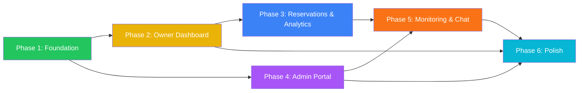

# PLAN: Next.js Web Booking App (StayEase Web Portal)

> **Plan ID**: `PLAN-web-booking-app`
> **Created**: 2026-02-28
> **Stack**: Next.js 15 (App Router) + TailwindCSS + Shadcn/UI + React Query + Zustand
> **Roles**: Hotel Owner, Admin
> **Theme**: Light Mode & Dark Mode (Full Support)
> **Backend Refs**: `task_plan_concurrency.md`, `task_plan_search.md`, `task_plan_saga.md`
> **Mobile Ref**: `docs/mobile/PLAN-mobile-booking-app.md`

---

## 📋 Table of Contents

1. [Executive Summary](#-1-executive-summary)
2. [Architecture Overview](#-2-architecture-overview)
3. [Tech Stack & Dependencies](#-3-tech-stack--dependencies)
4. [Directory Structure](#-4-directory-structure)
5. [Design System — Light & Dark Mode](#-5-design-system--light--dark-mode)
6. [Role-Based Feature Matrix](#-6-role-based-feature-matrix)
7. [Phase Breakdown](#-7-phase-breakdown)
8. [Page Inventory & Navigation Map](#-8-page-inventory--navigation-map)
9. [API Integration Map](#-9-api-integration-map)
10. [UI/UX Specifications per Role](#-10-uiux-specifications-per-role)
11. [Verification Plan](#-11-verification-plan)
12. [Risk Assessment](#-12-risk-assessment)

---

## 🎯 1. Executive Summary

Build a **premium, production-grade Web Portal** for the StayEase Hotel Booking platform, focused on **two management roles**: **Hotel Owner** and **Admin**. The web app provides widescreen-optimized dashboards, data tables, analytics, and real-time monitoring — complementing the mobile app (which serves Guests primarily).

### Why Web for Owner & Admin?

| Concern | Mobile (Guest-focused) | Web (Management-focused) |
|---|---|---|
| Screen real estate | Limited | **Wide dashboards, multi-column layouts** |
| Data entry | Cumbersome | **Full keyboard, bulk operations** |
| Data visualization | Small charts | **Interactive charts, large tables** |
| Multi-tasking | Single-task | **Side-by-side panels, tabs** |
| Accessibility | Touch-first | **Mouse + Keyboard shortcuts** |

### Design Inspiration

- **Booking.com Extranet** — Hotel Owner portal with calendar management
- **Agoda YCS (Yield Control System)** — Revenue management & analytics
- **Traveloka Console** — Admin oversight & approval workflows
- **Vercel Dashboard** — Modern dark mode, clean data visualization
- **Linear** — Keyboard-first navigation, command palette

### Success Criteria

- [ ] Hotel Owner can manage all properties, rooms, inventory, and view analytics
- [ ] Admin can approve hotels, manage users, and monitor system health in real-time
- [ ] Full Light & Dark mode with system preference auto-detection
- [ ] Real-time data via WebSocket (bookings, system health)
- [ ] Lighthouse score: **>90** (Performance, Accessibility, SEO)
- [ ] Responsive down to **1024px** tablet, optimized for **1440px+** desktop

---

## 🏗️ 2. Architecture Overview

### 2.1 High-Level Architecture

```
┌──────────────────────────────────────────────────────────────────┐
│                    WEB APP (Next.js 15)                           │
│                                                                  │
│  ┌────────────────────────┐    ┌────────────────────────────┐    │
│  │    Hotel Owner Portal  │    │      Admin Portal          │    │
│  │    (Sidebar Layout)    │    │    (Sidebar Layout)        │    │
│  └──────────┬─────────────┘    └─────────────┬──────────────┘    │
│             │                                 │                   │
│  ┌──────────▼─────────────────────────────────▼──────────────┐   │
│  │                  Shared Services Layer                     │   │
│  │  ┌──────────┐ ┌──────────┐ ┌─────────┐ ┌──────────────┐  │   │
│  │  │ Zustand  │ │  React   │ │ WebSocket│ │  next-themes │  │   │
│  │  │  Store   │ │  Query   │ │  Client  │ │ (Dark Mode)  │  │   │
│  │  └──────────┘ └──────────┘ └─────────┘ └──────────────┘  │   │
│  └───────────────────────┬───────────────────────────────────┘   │
│                          │ HTTPS / WSS                            │
└──────────────────────────┼───────────────────────────────────────┘
                           │
┌──────────────────────────▼───────────────────────────────────────┐
│                   BACKEND (Go + Gin)                              │
│  ┌──────────┐  ┌──────────┐  ┌────────────────────────────────┐  │
│  │ Booking  │  │  Search  │  │  Payment / Notification        │  │
│  │ Service  │  │  Service │  │       Service                  │  │
│  └──────────┘  └──────────┘  └────────────────────────────────┘  │
│  ┌──────────┐  ┌──────────┐  ┌────────────────────────────────┐  │
│  │PostgreSQL│  │  Redis   │  │     Elasticsearch              │  │
│  └──────────┘  └──────────┘  └────────────────────────────────┘  │
└──────────────────────────────────────────────────────────────────┘
```

### 2.2 Data Flow Alignment with Backend

| Web Feature | Backend Task Plan | API Endpoints | Key Behavior |
|---|---|---|---|
| **Owner Dashboard** | Analytics APIs | `GET /owner/analytics` | Revenue, occupancy KPIs |
| **Room Inventory** | `task_plan_concurrency.md` | `PUT /owner/rooms/{id}/inventory` | Calendar-based availability |
| **Booking Management** | `task_plan_saga.md` | `GET /owner/reservations` | Real-time status via WebSocket |
| **Admin Hotel Approval** | — | `PUT /admin/hotels/{id}/approve` | Approve/reject + notification |
| **System Health** | `task_plan_saga.md` §4.2 | `GET /admin/system/health` | Redis, MQ, DB live status |
| **Real-time Analytics** | `task_plan_saga.md` | WebSocket `/ws/admin` | User count, transactions |

---

## ⚙️ 3. Tech Stack & Dependencies

### 3.1 Core Stack (Per PROJECT_RULES.md §1.2)

| Category | Technology | Version | Rationale |
|---|---|---|---|
| **Framework** | Next.js (App Router) | 15+ | Server Components, RSC streaming |
| **Styling** | TailwindCSS | v4+ | Utility-first, dark mode built-in |
| **Components** | Shadcn/UI | Latest | Radix primitives, fully customizable |
| **State (Client)** | Zustand | v5+ | Shared pattern with mobile |
| **State (Server)** | TanStack React Query | v5+ | Cache, retry, real-time refetch |
| **Charts** | Recharts | v2+ | Composable, responsive, dark-mode ready |
| **Tables** | TanStack Table | v8+ | Sorting, filtering, pagination |
| **Forms** | React Hook Form + Zod | Latest | Type-safe validation |
| **Theme** | next-themes | Latest | Dark/Light with system detection |
| **Icons** | Lucide React | Latest | Consistent, tree-shakable |
| **Date Picker** | date-fns + react-day-picker | Latest | Calendar grids for inventory |
| **Toast** | Sonner | Latest | Modern notification toasts |
| **Command** | cmdk | Latest | Command palette (⌘+K) |
| **HTTP** | Axios | v1+ | Interceptors, shared with mobile |
| **WebSocket** | Native WebSocket + reconnecting-websocket | Latest | Real-time updates |

### 3.2 Dev Tools

| Tool | Purpose |
|---|---|
| TypeScript | Strict mode, path aliases (`@/`) |
| ESLint + Prettier | Code quality |
| Playwright | E2E browser testing |
| Storybook | Component development & documentation |
| Chromatic | Visual regression testing |

---

## 📁 4. Directory Structure

```
web/
├── app/                              # Next.js App Router
│   ├── layout.tsx                   # Root layout (providers, fonts, theme)
│   ├── page.tsx                     # Landing → redirect by role
│   ├── globals.css                  # Tailwind base + CSS variables
│   │
│   ├── (auth)/                      # Auth routes (no sidebar)
│   │   ├── layout.tsx
│   │   ├── login/page.tsx
│   │   └── forgot-password/page.tsx
│   │
│   ├── (owner)/                     # Hotel Owner portal
│   │   ├── layout.tsx               # Sidebar layout (Owner nav)
│   │   ├── dashboard/
│   │   │   └── page.tsx             # KPI cards + Revenue chart + Activity
│   │   ├── properties/
│   │   │   ├── page.tsx             # My Hotels grid/list
│   │   │   ├── [id]/
│   │   │   │   ├── page.tsx         # Hotel detail & edit
│   │   │   │   ├── rooms/
│   │   │   │   │   ├── page.tsx     # Room list for hotel
│   │   │   │   │   ├── new/page.tsx # Create room
│   │   │   │   │   └── [roomId]/
│   │   │   │   │       ├── page.tsx # Edit room
│   │   │   │   │       └── inventory/page.tsx  # Calendar inventory
│   │   │   │   └── settings/page.tsx
│   │   │   └── new/page.tsx         # Create hotel
│   │   ├── reservations/
│   │   │   ├── page.tsx             # All bookings table
│   │   │   └── [id]/page.tsx        # Reservation detail
│   │   ├── analytics/
│   │   │   └── page.tsx             # Charts: Occupancy, Revenue, Trends
│   │   ├── messages/
│   │   │   └── page.tsx             # Guest messaging (Chat)
│   │   └── settings/
│   │       └── page.tsx             # Owner profile & preferences
│   │
│   ├── (admin)/                     # Admin portal
│   │   ├── layout.tsx               # Sidebar layout (Admin nav)
│   │   ├── dashboard/
│   │   │   └── page.tsx             # System overview + Real-time analytics
│   │   ├── hotels/
│   │   │   ├── page.tsx             # Hotel approval table
│   │   │   └── [id]/page.tsx        # Hotel review & approve/reject
│   │   ├── users/
│   │   │   ├── page.tsx             # User management table
│   │   │   └── [id]/page.tsx        # User detail & role assignment
│   │   ├── bookings/
│   │   │   ├── page.tsx             # All bookings oversight
│   │   │   └── [id]/page.tsx        # Booking detail + dispute
│   │   ├── analytics/
│   │   │   └── page.tsx             # Platform-wide analytics
│   │   ├── system/
│   │   │   ├── page.tsx             # System health dashboard
│   │   │   ├── logs/page.tsx        # Event/Error logs
│   │   │   └── dlq/page.tsx         # Dead Letter Queue monitor
│   │   ├── messages/
│   │   │   └── page.tsx             # Support & Chat management
│   │   └── settings/
│   │       └── page.tsx             # Admin settings & feature flags
│   │
│   └── api/                         # API routes (if needed)
│       └── auth/[...nextauth]/route.ts
│
├── components/                       # Reusable UI components
│   ├── ui/                          # Shadcn/UI base (auto-generated)
│   │   ├── button.tsx
│   │   ├── input.tsx
│   │   ├── card.tsx
│   │   ├── table.tsx
│   │   ├── dialog.tsx
│   │   ├── dropdown-menu.tsx
│   │   ├── badge.tsx
│   │   ├── avatar.tsx
│   │   ├── skeleton.tsx
│   │   ├── command.tsx              # ⌘+K palette
│   │   ├── sheet.tsx
│   │   ├── tabs.tsx
│   │   ├── tooltip.tsx
│   │   └── chart.tsx                # Recharts wrapper
│   ├── layout/                      # Layout components
│   │   ├── sidebar.tsx              # Collapsible sidebar
│   │   ├── header.tsx               # Top bar (search, theme toggle, user)
│   │   ├── breadcrumb.tsx
│   │   └── theme-toggle.tsx         # Light/Dark/System switcher
│   ├── dashboard/                   # Dashboard components
│   │   ├── kpi-card.tsx             # Stat card with trend indicator
│   │   ├── revenue-chart.tsx        # Interactive line/bar chart
│   │   ├── occupancy-chart.tsx      # Occupancy heatmap
│   │   ├── activity-feed.tsx        # Recent activity list
│   │   └── quick-actions.tsx        # Action buttons grid
│   ├── owner/                       # Owner-specific
│   │   ├── property-card.tsx        # Hotel card for grid view
│   │   ├── room-form.tsx            # Create/edit room form
│   │   ├── inventory-calendar.tsx   # Date grid for availability
│   │   ├── booking-table.tsx        # Reservations data table
│   │   └── pricing-editor.tsx       # Dynamic pricing UI
│   ├── admin/                       # Admin-specific
│   │   ├── hotel-approval-card.tsx  # Approve/reject card
│   │   ├── user-table.tsx           # User management table
│   │   ├── system-health.tsx        # Service status indicators
│   │   ├── realtime-counter.tsx     # Live user/transaction counter
│   │   └── log-viewer.tsx           # Event/Error log viewer
│   └── chat/                        # Chat components
│       ├── chat-sidebar.tsx         # Conversation list
│       ├── chat-window.tsx          # Message thread
│       ├── message-bubble.tsx       # Individual message
│       └── chat-input.tsx           # Message input with attachments
│
├── hooks/                            # Custom hooks
│   ├── use-auth.ts
│   ├── use-role.ts                  # Role-based access
│   ├── use-theme.ts                 # Theme management
│   ├── use-websocket.ts             # Real-time connection
│   ├── use-sidebar.ts               # Sidebar state
│   ├── use-data-table.ts            # Table filtering/sorting
│   └── use-keyboard-shortcuts.ts    # ⌘+K, navigation shortcuts
│
├── services/                         # API layer
│   ├── api.ts                       # Axios instance + interceptors
│   ├── auth.service.ts
│   ├── hotel.service.ts
│   ├── booking.service.ts
│   ├── analytics.service.ts
│   ├── admin.service.ts
│   ├── chat.service.ts
│   └── system.service.ts
│
├── stores/                           # Zustand stores
│   ├── auth.store.ts
│   ├── sidebar.store.ts
│   ├── notification.store.ts
│   └── chat.store.ts
│
├── types/                            # TypeScript types
│   ├── hotel.types.ts
│   ├── booking.types.ts
│   ├── user.types.ts
│   ├── analytics.types.ts
│   ├── chat.types.ts
│   └── api.types.ts
│
├── lib/                              # Utilities
│   ├── utils.ts                     # cn() utility, formatters
│   ├── validations.ts               # Zod schemas
│   └── constants.ts                 # API endpoints, feature flags
│
├── public/                           # Static assets
│   ├── logo.svg
│   └── favicon.ico
│
├── tailwind.config.ts
├── next.config.js
├── tsconfig.json
├── components.json                   # Shadcn/UI config
├── package.json
└── README.md
```

---

## 🎨 5. Design System — Light & Dark Mode

### 5.1 Color System (CSS Variables for Theme Switching)

> Uses the same brand palette as mobile (`PLAN-mobile-booking-app.md` §9.1), extended with CSS variable tokens for seamless Light/Dark switching.

```css
/* globals.css — HSL-based tokens for Shadcn/UI compatibility */

@layer base {
  :root {
    /* Light Mode */
    --background: 0 0% 100%;
    --foreground: 222 47% 11%;         /* Slate 900 */
    --card: 0 0% 100%;
    --card-foreground: 222 47% 11%;
    --popover: 0 0% 100%;
    --popover-foreground: 222 47% 11%;
    --primary: 217 60% 26%;            /* Deep Navy #1A3A6B */
    --primary-foreground: 210 40% 98%;
    --secondary: 210 40% 96%;
    --secondary-foreground: 222 47% 11%;
    --muted: 210 40% 96%;
    --muted-foreground: 215 16% 47%;
    --accent: 14 100% 60%;             /* Coral Sunset #FF5733 */
    --accent-foreground: 0 0% 100%;
    --destructive: 0 84% 60%;
    --destructive-foreground: 0 0% 100%;
    --border: 214 32% 91%;
    --input: 214 32% 91%;
    --ring: 217 60% 26%;
    --chart-1: 217 60% 26%;            /* Primary */
    --chart-2: 160 60% 45%;            /* Emerald */
    --chart-3: 38 92% 50%;             /* Amber */
    --chart-4: 14 100% 60%;            /* Coral */
    --chart-5: 262 52% 47%;            /* Purple */
    --sidebar-background: 0 0% 98%;
    --sidebar-foreground: 215 16% 47%;
    --sidebar-primary: 217 60% 26%;
    --sidebar-primary-foreground: 210 40% 98%;
    --sidebar-accent: 210 40% 96%;
    --sidebar-accent-foreground: 222 47% 11%;
    --sidebar-border: 214 32% 91%;
    --radius: 0.625rem;
  }

  .dark {
    /* Dark Mode */
    --background: 224 71% 4%;          /* Near-black with blue tint */
    --foreground: 213 31% 91%;
    --card: 224 71% 4%;
    --card-foreground: 213 31% 91%;
    --popover: 224 71% 4%;
    --popover-foreground: 213 31% 91%;
    --primary: 217 60% 50%;            /* Brighter Navy for dark */
    --primary-foreground: 210 40% 98%;
    --secondary: 222 47% 11%;
    --secondary-foreground: 213 31% 91%;
    --muted: 223 47% 11%;
    --muted-foreground: 215 16% 57%;
    --accent: 14 100% 60%;             /* Coral stays vibrant */
    --accent-foreground: 0 0% 100%;
    --destructive: 0 63% 31%;
    --destructive-foreground: 0 0% 100%;
    --border: 216 34% 17%;
    --input: 216 34% 17%;
    --ring: 217 60% 50%;
    --chart-1: 217 60% 60%;
    --chart-2: 160 60% 55%;
    --chart-3: 38 92% 60%;
    --chart-4: 14 100% 65%;
    --chart-5: 262 52% 60%;
    --sidebar-background: 224 71% 4%;
    --sidebar-foreground: 215 16% 57%;
    --sidebar-primary: 217 60% 50%;
    --sidebar-primary-foreground: 210 40% 98%;
    --sidebar-accent: 222 47% 11%;
    --sidebar-accent-foreground: 213 31% 91%;
    --sidebar-border: 216 34% 17%;
  }
}
```

### 5.2 Typography (Google Fonts)

```typescript
// app/layout.tsx
import { Plus_Jakarta_Sans, Inter, DM_Sans } from 'next/font/google';

const heading = Plus_Jakarta_Sans({ subsets: ['latin'], variable: '--font-heading' });
const body = Inter({ subsets: ['latin'], variable: '--font-body' });
const mono = DM_Sans({ subsets: ['latin'], variable: '--font-mono' }); // Prices/numbers
```

### 5.3 Theme Toggle Component

```
[☀️ Light] [🌙 Dark] [💻 System]   ← Three-state toggle in header
```

- Uses `next-themes` with `attribute="class"` strategy
- Persists preference in `localStorage`
- Defaults to system preference on first visit
- All Shadcn/UI components auto-adapt via CSS variables
- Charts (Recharts) use `--chart-*` CSS variables

### 5.4 Sidebar Design Tokens

| Property | Light Mode | Dark Mode |
|---|---|---|
| Background | `#F9FAFB` (Gray 50) | `#0A0F1A` (Near-black) |
| Active Item BG | `#E8EDF5` (Primary 50) | `rgba(93,123,193,0.15)` |
| Active Item Text | `#1A3A6B` (Primary 500) | `#7993CB` (Primary 300) |
| Hover BG | `#F1F5F9` (Slate 100) | `rgba(255,255,255,0.05)` |
| Border Right | `#E2E8F0` (Slate 200) | `#1E293B` (Slate 800) |
| Width (Expanded) | `280px` | `280px` |
| Width (Collapsed) | `68px` | `68px` |

---

## 👥 6. Role-Based Feature Matrix

### 6.1 Hotel Owner Role 🏨

| Feature | Priority | Backend Ref | Description |
|---|---|---|---|
| **Dashboard** | P0 | Analytics APIs | KPI cards, revenue chart, occupancy, recent activity |
| **My Properties** | P0 | `GET /owner/hotels` | Grid/list view of all hotels with quick stats |
| **Property Detail** | P0 | `GET /owner/hotels/{id}` | Full hotel management (edit, photos, amenities) |
| **Room Management** | P0 | CRUD `/owner/rooms` | Table view, create/edit room with pricing |
| **Inventory Calendar** | P0 | `task_plan_concurrency.md` | Visual calendar grid to set daily availability |
| **Reservations** | P0 | `task_plan_saga.md` | Data table with filters, real-time status |
| **Analytics** | P1 | — | Occupancy trends, revenue by room type, comparison |
| **Messaging / Chat** | P1 | WebSocket | Real-time chat with guests |
| **Dynamic Pricing** | P2 | — | Rules-based pricing (weekday/weekend, season) |
| **Owner Settings** | P1 | — | Profile, notification preferences, payout info |

### 6.2 Admin Role 🛡️

| Feature | Priority | Backend Ref | Description |
|---|---|---|---|
| **System Dashboard** | P0 | — | Real-time counters: users, bookings, revenue |
| **Hotel Approvals** | P0 | `PUT /admin/hotels/{id}/approve` | Review queue with approve/reject actions |
| **User Management** | P0 | CRUD `/admin/users` | Data table with role assignment, ban/unban |
| **Booking Oversight** | P1 | `task_plan_concurrency.md` | All bookings, dispute resolution |
| **Platform Analytics** | P1 | — | Transaction volume, growth metrics, geo breakdown |
| **System Health** | P1 | `task_plan_saga.md` §4.2 | Redis, MQ, DB, Elasticsearch status |
| **Event Logs** | P1 | `task_plan_saga.md` §4.1 | DLQ monitoring, failed events, error logs |
| **Chat Management** | P1 | WebSocket | Support tickets, escalation |
| **Feature Flags** | P2 | — | Toggle features remotely |
| **Admin Settings** | P1 | — | System config, notification rules |

---

## 🔄 7. Phase Breakdown

### 🟢 Phase 1: Foundation & Layout (Week 1-2)

> **Goal**: Scaffold Next.js app, implement sidebar layout, auth, and theme system.

| Task ID | Task | Dependencies |
|---|---|---|
| `W-1.1` | Initialize Next.js 15 project with TypeScript | None |
| `W-1.2` | Configure TailwindCSS v4 + CSS variables | W-1.1 |
| `W-1.3` | Install & configure Shadcn/UI (all needed components) | W-1.2 |
| `W-1.4` | Implement `next-themes` (Light/Dark/System) | W-1.2 |
| `W-1.5` | Build Sidebar component (collapsible, icon-only mode) | W-1.3 |
| `W-1.6` | Build Header component (search, theme toggle, user menu) | W-1.3 |
| `W-1.7` | Build `(owner)/layout.tsx` with Owner sidebar nav | W-1.5 |
| `W-1.8` | Build `(admin)/layout.tsx` with Admin sidebar nav | W-1.5 |
| `W-1.9` | Auth pages (Login, Forgot Password) | W-1.3 |
| `W-1.10` | Setup Axios instance + auth interceptors | W-1.1 |
| `W-1.11` | Setup Zustand stores (auth, sidebar, notification) | W-1.1 |
| `W-1.12` | Setup React Query provider + queryClient | W-1.1 |
| `W-1.13` | Role-based routing middleware | W-1.9 |
| `W-1.14` | Command palette (⌘+K) with navigation | W-1.3 |

**Deliverable**: App boots with login → redirect to Owner or Admin layout with working sidebar, dark mode toggle.

> [!IMPORTANT]
> Dark mode must work from Day 1. Every component must use CSS variable tokens, never hardcoded colors.

---

### 🟡 Phase 2: Hotel Owner Dashboard & Properties (Week 3-4)

> **Goal**: Build the Owner's primary workspace — dashboard and property management.

| Task ID | Task | Dependencies |
|---|---|---|
| `W-2.1` | Build `kpi-card.tsx` (with trend arrow, sparkline) | W-1.3 |
| `W-2.2` | Build `revenue-chart.tsx` (Recharts line/bar) | W-1.3 |
| `W-2.3` | Build `activity-feed.tsx` (real-time activity stream) | W-1.3 |
| `W-2.4` | **Owner Dashboard page** (KPIs + Chart + Activity) | W-2.1–2.3 |
| `W-2.5` | Build `property-card.tsx` (hotel card with stats) | W-1.3 |
| `W-2.6` | **My Properties page** (grid/list toggle) | W-2.5 |
| `W-2.7` | **Create Hotel page** (multi-step form with image upload) | W-1.3 |
| `W-2.8` | **Hotel Detail / Edit page** | W-2.6 |
| `W-2.9` | Build `room-form.tsx` (create/edit room) | W-1.3 |
| `W-2.10` | **Room Management page** (TanStack Table) | W-2.9 |
| `W-2.11` | Build `inventory-calendar.tsx` (date grid for availability) | W-1.3 |
| `W-2.12` | **Inventory Calendar page** | W-2.11 |
| `W-2.13` | Photo upload component (drag & drop, reorder) | W-1.10 |

**Deliverable**: Owner can view dashboard, manage properties/rooms, and set inventory.

> [!WARNING]
> Inventory Calendar must show availability status with color coding:
> - 🟢 Available (green)
> - 🟡 Limited (amber, <30% remaining)
> - 🔴 Sold Out (red)
> - ⬜ Blocked (gray, manually closed)

---

### 🔵 Phase 3: Reservations & Analytics (Week 5-6)

> **Goal**: Build reservation management and analytics for Hotel Owner.

| Task ID | Task | Dependencies |
|---|---|---|
| `W-3.1` | Build `booking-table.tsx` (TanStack Table with filters) | W-1.3 |
| `W-3.2` | **Reservations page** (searchable, filterable table) | W-3.1 |
| `W-3.3` | **Reservation Detail page** (guest info, status, timeline) | W-3.2 |
| `W-3.4` | WebSocket integration for real-time booking updates | W-1.10 |
| `W-3.5` | Build `occupancy-chart.tsx` (heatmap/calendar) | W-1.3 |
| `W-3.6` | **Analytics page** (occupancy trends, revenue by room) | W-3.5 |
| `W-3.7` | Date range filter component (7d, 30d, 90d, custom) | W-1.3 |
| `W-3.8` | Export data as CSV/PDF | W-3.2 |
| `W-3.9` | **Owner Settings page** (profile, notifications, payout) | W-1.3 |

**Deliverable**: Owner can track all reservations in real-time and analyze performance.

---

### 🟣 Phase 4: Admin Portal (Week 7-8)

> **Goal**: Build the Admin oversight dashboard and management tools.

| Task ID | Task | Dependencies |
|---|---|---|
| `W-4.1` | Build `realtime-counter.tsx` (animated live counters) | W-1.3 |
| `W-4.2` | Build `system-health.tsx` (service status cards) | W-1.3 |
| `W-4.3` | **Admin Dashboard page** (live metrics + health + activity) | W-4.1, W-4.2 |
| `W-4.4` | Build `hotel-approval-card.tsx` (gallery + info + actions) | W-1.3 |
| `W-4.5` | **Hotel Approvals page** (queue with filters) | W-4.4 |
| `W-4.6` | **Hotel Review page** (detail + approve/reject dialog) | W-4.5 |
| `W-4.7` | Build `user-table.tsx` (TanStack Table, role badges) | W-1.3 |
| `W-4.8` | **User Management page** (search, filter, bulk actions) | W-4.7 |
| `W-4.9` | **User Detail page** (profile, history, role assignment) | W-4.8 |
| `W-4.10` | **Booking Oversight page** (all bookings, dispute tools) | W-3.1 |
| `W-4.11` | **Platform Analytics page** (revenue, users, growth) | W-2.2 |
| `W-4.12` | WebSocket for admin real-time data | W-1.10 |

**Deliverable**: Admin can monitor the platform, approve hotels, manage users.

---

### 🟠 Phase 5: System Monitoring & Chat (Week 9-10)

> **Goal**: Build system monitoring, event logs, and real-time chat.

| Task ID | Task | Dependencies |
|---|---|---|
| `W-5.1` | **System Health Dashboard** (Redis, MQ, DB, ES status) | W-4.2 |
| `W-5.2` | Build `log-viewer.tsx` (virtual-scrolled log display) | W-1.3 |
| `W-5.3` | **Event Logs page** (filterable, searchable logs) | W-5.2 |
| `W-5.4` | **DLQ Monitor page** (dead letter queue visualization) | W-5.2 |
| `W-5.5` | Build `chat-sidebar.tsx` (conversation list) | W-1.3 |
| `W-5.6` | Build `chat-window.tsx` + `message-bubble.tsx` | W-1.3 |
| `W-5.7` | Build `chat-input.tsx` (text + attachments) | W-1.3 |
| `W-5.8` | **Owner Messages page** (chat with guests) | W-5.5-5.7 |
| `W-5.9` | **Admin Chat Management page** (support tickets) | W-5.5-5.7 |
| `W-5.10` | WebSocket for real-time chat | W-1.10 |
| `W-5.11` | **Feature Flags page** (admin only) | W-1.3 |

**Deliverable**: Full monitoring suite and real-time messaging.

---

### ⚡ Phase 6: Polish & Performance (Week 11-12)

| Task ID | Task |
|---|---|
| `W-6.1` | Keyboard shortcuts for all major actions |
| `W-6.2` | Skeleton loading states for all pages |
| `W-6.3` | Error boundaries + 404/500 pages |
| `W-6.4` | Responsive layout testing (1024px – 2560px) |
| `W-6.5` | Accessibility audit (WCAG 2.1 AA) |
| `W-6.6` | Performance optimization (code splitting, lazy loading) |
| `W-6.7` | SEO meta tags for all pages |
| `W-6.8` | Playwright E2E test suite |
| `W-6.9` | Storybook documentation for all components |
| `W-6.10` | Visual regression tests (Chromatic) |

---

## 🗺️ 8. Page Inventory & Navigation Map

### 8.1 Hotel Owner Navigation (Sidebar)

```
📊 Dashboard                    ← KPIs, Revenue Chart, Activity Feed
│
🏨 Properties                   ← My Hotels (Grid/List)
│   ├─ Hotel [id]               ← Hotel Detail & Edit
│   │   ├─ Rooms                ← Room Management Table
│   │   │   ├─ New Room         ← Create Room Form
│   │   │   └─ Room [id]        ← Edit Room
│   │   │       └─ Inventory    ← Calendar Availability
│   │   └─ Settings             ← Hotel Settings
│   └─ New Property             ← Create Hotel Form
│
📋 Reservations                  ← Bookings Data Table
│   └─ Reservation [id]         ← Detail + Timeline
│
📈 Analytics                     ← Occupancy, Revenue Trends
│
💬 Messages                      ← Guest Chat
│
⚙️ Settings                     ← Profile, Notifications, Payout
```

### 8.2 Admin Navigation (Sidebar)

```
📊 Dashboard                    ← Real-time Metrics, System Health
│
🏨 Hotels                       ← Approval Queue Table
│   └─ Hotel [id]               ← Review & Approve/Reject
│
👥 Users                         ← User Management Table
│   └─ User [id]                ← Profile, Role, History
│
📋 Bookings                      ← All Bookings Oversight
│   └─ Booking [id]             ← Detail + Dispute
│
📈 Analytics                     ← Platform-wide Metrics
│
🖥️ System                       ← System Health Dashboard
│   ├─ Logs                     ← Event/Error Logs
│   └─ DLQ                      ← Dead Letter Queue
│
💬 Support                       ← Chat Management
│
⚙️ Settings                     ← Config, Feature Flags
```

**Total Pages**: ~30+ unique pages

---

## 🔌 9. API Integration Map

### 9.1 Auth APIs (Shared with Mobile)

| Method | Endpoint | Web Usage |
|---|---|---|
| `POST` | `/auth/login` | Login page |
| `POST` | `/auth/refresh` | Axios interceptor |
| `GET` | `/auth/me` | Role check + profile |

### 9.2 Owner APIs

| Method | Endpoint | Web Usage |
|---|---|---|
| `GET` | `/owner/hotels` | Properties page |
| `POST` | `/owner/hotels` | Create hotel |
| `PUT` | `/owner/hotels/{id}` | Edit hotel |
| `DELETE` | `/owner/hotels/{id}` | Delete hotel |
| `GET` | `/owner/hotels/{id}/rooms` | Room management |
| `POST` | `/owner/hotels/{id}/rooms` | Create room |
| `PUT` | `/owner/rooms/{id}` | Edit room |
| `PUT` | `/owner/rooms/{id}/inventory` | Update availability |
| `GET` | `/owner/reservations` | Reservations table |
| `GET` | `/owner/analytics` | Dashboard & Analytics |
| `PUT` | `/owner/reservations/{id}/status` | Accept/reject booking |

### 9.3 Admin APIs

| Method | Endpoint | Web Usage |
|---|---|---|
| `GET` | `/admin/dashboard` | Dashboard metrics |
| `GET` | `/admin/users` | User management |
| `PUT` | `/admin/users/{id}/role` | Role assignment |
| `PUT` | `/admin/users/{id}/ban` | Ban/unban user |
| `GET` | `/admin/hotels/pending` | Approval queue |
| `PUT` | `/admin/hotels/{id}/approve` | Approve hotel |
| `PUT` | `/admin/hotels/{id}/reject` | Reject hotel |
| `GET` | `/admin/bookings` | All bookings |
| `GET` | `/admin/analytics` | Platform analytics |
| `GET` | `/admin/system/health` | System health |
| `GET` | `/admin/events/logs` | Event logs |
| `GET` | `/admin/events/dlq` | Dead letter queue |

### 9.4 WebSocket Channels

| Channel | Events | Web Usage |
|---|---|---|
| `ws://api/ws/owner/{ownerId}` | `booking.new`, `booking.status` | Live reservation updates |
| `ws://api/ws/admin` | `system.health`, `user.activity`, `booking.volume` | Real-time dashboard |
| `ws://api/ws/chat/{userId}` | `message.new`, `message.read` | Chat messaging |

---

## 🖥️ 10. UI/UX Specifications per Role

### 10.1 Hotel Owner Dashboard (Light & Dark)

#### Layout Structure
```
┌─────────┬──────────────────────────────────────────────────┐
│         │  Header: Breadcrumb | Search(⌘K) | 🔔 | 🌙 | 👤 │
│         ├──────────────────────────────────────────────────┤
│  S      │                                                  │
│  I      │  ┌──────┐ ┌──────┐ ┌──────┐ ┌──────┐           │
│  D      │  │ Total│ │Occup.│ │ Rev. │ │ New  │  ← KPIs   │
│  E      │  │Rooms │ │ Rate │ │Today │ │Books │           │
│  B      │  └──────┘ └──────┘ └──────┘ └──────┘           │
│  A      │                                                  │
│  R      │  ┌─────────────────────┐ ┌──────────────────┐   │
│         │  │                     │ │  Recent Activity  │   │
│  📊     │  │   Revenue Chart     │ │  ┌─ Booking #123 │   │
│  🏨     │  │   (Interactive)     │ │  ├─ Room edited  │   │
│  📋     │  │   Line + Bar combo  │ │  ├─ New review   │   │
│  📈     │  │                     │ │  └─ Check-in     │   │
│  💬     │  └─────────────────────┘ └──────────────────┘   │
│  ⚙️     │                                                  │
└─────────┴──────────────────────────────────────────────────┘
```

#### KPI Card Design
- **Light**: White card, subtle shadow, colored icon accent
- **Dark**: Dark card (`--card`), border glow, colored icon accent
- Trend indicator: `↑ 12.5%` green or `↓ 3.2%` red
- Mini sparkline chart in bottom of card

#### Revenue Chart
- Recharts `ComposedChart` (Line for revenue, Bar for bookings)
- Toggle: Day / Week / Month / Year
- Hover tooltip with detailed breakdown
- Uses `--chart-*` CSS variables for auto dark mode

---

### 10.2 Admin Dashboard (Light & Dark)

#### Layout Structure
```
┌─────────┬──────────────────────────────────────────────────┐
│         │  Header: Breadcrumb | Search(⌘K) | 🔔 | 🌙 | 👤 │
│         ├──────────────────────────────────────────────────┤
│  S      │                                                  │
│  I      │  ┌──────┐ ┌──────┐ ┌──────┐ ┌──────┐           │
│  D      │  │Active│ │Total │ │Today │ │System│  ← Live   │
│  E      │  │Users │ │Hotels│ │Trans.│ │Load  │  Counters │
│  B      │  └──────┘ └──────┘ └──────┘ └──────┘           │
│  A      │                                                  │
│  R      │  ┌──────────────────────────────────────────┐   │
│         │  │  System Health                            │   │
│  📊     │  │  ┌──────┐ ┌──────┐ ┌──────┐ ┌──────┐    │   │
│  🏨     │  │  │Postgres│ │Redis │ │RabbitMQ│ │Elastic│   │   │
│  👥     │  │  │  ✅   │ │  ✅  │ │  ⚠️   │ │  ✅  │    │   │
│  📋     │  │  └──────┘ └──────┘ └──────┘ └──────┘    │   │
│  📈     │  └──────────────────────────────────────────┘   │
│  🖥️     │                                                  │
│  💬     │  ┌─────────────────────┐ ┌──────────────────┐   │
│  ⚙️     │  │ Pending Approvals   │ │ Recent Activity  │   │
│         │  │ ┌─ Hotel ABC (new)  │ │ ┌─ User banned   │   │
│         │  │ ├─ Hotel XYZ (new)  │ │ ├─ Hotel approved│   │
│         │  │ └─ 3 more pending   │ │ └─ DLQ alert     │   │
│         │  └─────────────────────┘ └──────────────────┘   │
└─────────┴──────────────────────────────────────────────────┘
```

#### Real-time Counters
- Animated number transitions (count up/down effect)
- WebSocket-driven, updates every second
- Pulse animation on value change
- Color-coded: Green (normal), Amber (warning), Red (critical)

#### System Health Cards
- Per-service status: `✅ Healthy`, `⚠️ Degraded`, `❌ Down`
- Latency bar (ms) with threshold coloring
- Last checked timestamp
- Click to expand → detailed metrics

---

### 10.3 Hotel Approval Workflow (Admin)

```
┌─────────────────────────────────────────────────────────┐
│  Hotel Approvals                           Filter ▾     │
├─────────────────────────────────────────────────────────┤
│                                                         │
│  ┌─────────────────────────────────────────────────┐    │
│  │ 📷 [Gallery] │ Grand Palace Hotel               │    │
│  │              │ 📍 Ho Chi Minh City, Vietnam     │    │
│  │              │ 🏠 45 rooms • ⭐ 4-star           │    │
│  │              │ 👤 Owner: Nguyen Van A            │    │
│  │              │ 📅 Submitted: 2 hours ago         │    │
│  │              │                                   │    │
│  │              │ [✅ Approve]  [❌ Reject]  [👁 View] │    │
│  └─────────────────────────────────────────────────┘    │
│                                                         │
│  ┌─────────────────────────────────────────────────┐    │
│  │ 📷 [Gallery] │ Sunrise Beach Resort             │    │
│  │              │ ...                               │    │
│  └─────────────────────────────────────────────────┘    │
└─────────────────────────────────────────────────────────┘
```

---

### 10.4 Chat Interface

```
┌─────────┬───────────────────────┬──────────────────────┐
│ Sidebar │   Conversations       │   Chat Window        │
│         │  ┌─────────────────┐  │                      │
│         │  │ 🟢 Guest John   │  │  John Doe            │
│         │  │   "Is WiFi...?" │  │  ─────────────────── │
│         │  ├─────────────────┤  │                      │
│         │  │ 🔵 Guest Mary   │  │  💬 Is WiFi free?    │
│         │  │   "Check-in..?" │  │                      │
│         │  ├─────────────────┤  │     Yes, it is! 💬   │
│         │  │ ⚪ Guest Alex   │  │                      │
│         │  │   "Thanks!"     │  │  💬 Great, thanks!   │
│         │  └─────────────────┘  │                      │
│         │                       │  ┌──────────────────┐ │
│         │                       │  │ Type a message...│ │
│         │                       │  └──────────────────┘ │
└─────────┴───────────────────────┴──────────────────────┘
```

---

## ✅ 11. Verification Plan

### 11.1 Automated Testing

| Layer | Tool | Coverage Target |
|---|---|---|
| **Unit** | Vitest + React Testing Library | Components, hooks: **80%** |
| **Integration** | Vitest + MSW | API integration: **70%** |
| **E2E** | Playwright | Critical flows: **100%** |
| **Visual** | Chromatic (Storybook) | All components: **100%** |

### 11.2 Critical E2E Scenarios

| Test ID | Scenario | Expected |
|---|---|---|
| `E2E-W01` | Owner: Login → Dashboard → View KPIs & chart | Data renders correctly |
| `E2E-W02` | Owner: Properties → Create Hotel → Add Rooms → Set Inventory | Full CRUD workflow |
| `E2E-W03` | Owner: Reservations → Filter → View Detail → Accept | Booking management |
| `E2E-W04` | Admin: Login → Dashboard → Real-time counters updating | WebSocket data flow |
| `E2E-W05` | Admin: Hotels → Review → Approve/Reject | Approval workflow |
| `E2E-W06` | Admin: Users → Search → Ban → Confirm | User management |
| `E2E-W07` | Admin: System → Health check → All services green | Monitoring works |
| `E2E-W08` | Theme: Toggle Light → Dark → System | All pages adapt correctly |
| `E2E-W09` | Chat: Send message → Receive reply → Notification | Real-time messaging |
| `E2E-W10` | Navigation: ⌘+K → type page name → navigate | Command palette works |

### 11.3 Performance Benchmarks

| Metric | Target | Tool |
|---|---|---|
| Lighthouse Performance | >90 | Chrome DevTools |
| First Contentful Paint | <1.2s | Lighthouse |
| Time to Interactive | <2.5s | Lighthouse |
| Bundle size (gzipped) | <200KB first load | `next build` |
| Dashboard render | <500ms | React DevTools Profiler |
| Theme switch | <100ms (no flash) | Manual |

### 11.4 Dark Mode Checklist

- [ ] All pages render correctly in Light mode
- [ ] All pages render correctly in Dark mode
- [ ] No hardcoded colors (only CSS variables)
- [ ] Charts use `--chart-*` variables
- [ ] Images have dark mode variants where needed
- [ ] No FOUC (flash of unstyled content) on theme load
- [ ] System preference detection works
- [ ] Theme persists across page reload

---

## ⚠️ 12. Risk Assessment

| Risk | Severity | Mitigation |
|---|---|---|
| **Dark mode FOUC** | 🔴 High | `next-themes` with `suppressHydrationWarning` + script in `<head>` |
| **Recharts dark mode** | 🟡 Medium | CSS variable-based theming, custom tooltip/legend components |
| **WebSocket reconnection** | 🟡 Medium | `reconnecting-websocket` library with exponential backoff |
| **Large data tables (10K+ rows)** | 🟡 Medium | TanStack Table with virtual scrolling (`@tanstack/react-virtual`) |
| **Image upload performance** | 🟡 Medium | Client-side compression before upload, progress indicator |
| **Inventory Calendar complexity** | 🟡 Medium | Virtualized date grid, load only visible month range |
| **Auth token expiry** | 🟢 Low | Axios interceptor auto-refresh (shared pattern with mobile) |
| **Sidebar state persistence** | 🟢 Low | Zustand with localStorage middleware |

---

## 📑 Appendix: Dependency Chain



---

> **DNA_REF**: `docs/PROJECT_ROADMAP.md`, `docs/PROJECT_RULES.md`, `docs/MASTER_FLOW.md`
> **Backend Refs**: `docs/tasks/task_plan_concurrency.md`, `docs/tasks/task_plan_search.md`, `docs/tasks/task_plan_saga.md`
> **Mobile Ref**: `docs/mobile/PLAN-mobile-booking-app.md`
> **Next Action**: Run `/create` or `/orchestrate` to begin Phase 1 execution.
